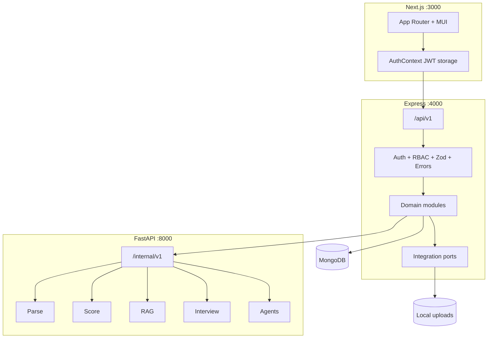
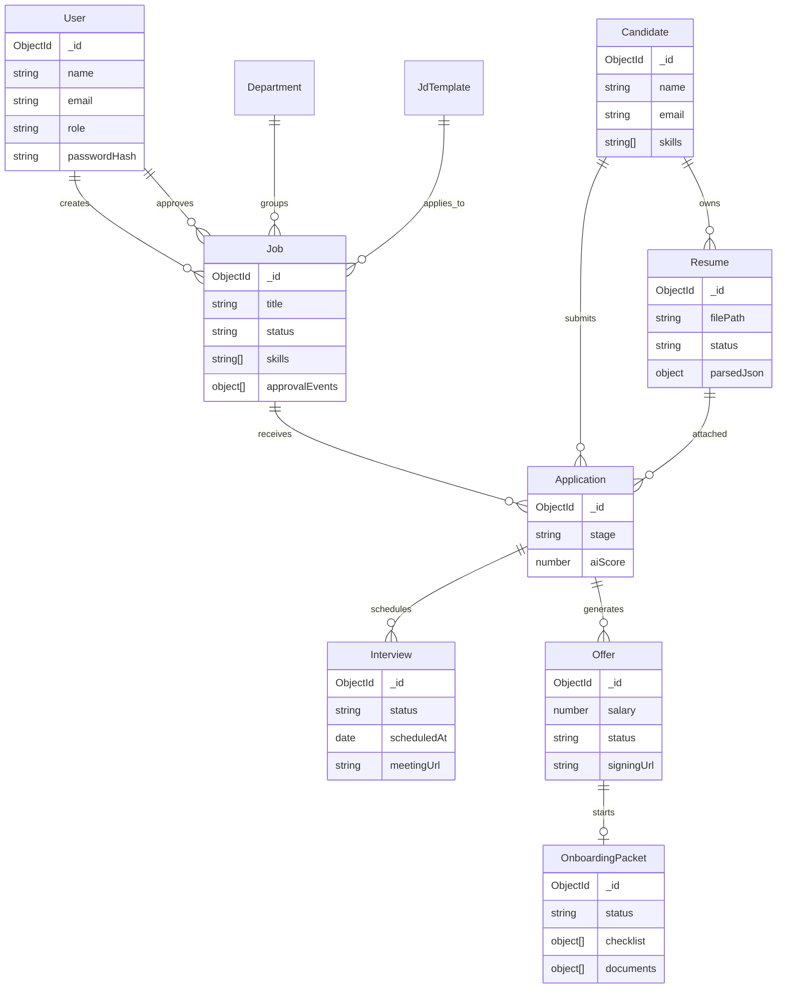

# ATS AI Platform

> An AI-assisted **Applicant Tracking System** that covers the full hiring lifecycle — from job description creation to employee onboarding — with a modern monorepo (Next.js + Express + FastAPI + MongoDB).

Built as a production-shaped learning / portfolio system: real architecture patterns (JWT RBAC, versioned APIs, integration ports, Docker, CI), with external vendors (S3, Zoom, DocuSign, Google Calendar) behind **swapable stub adapters** so the app runs fully offline.

---

## Why this project exists

Recruiting tools often split into disconnected steps (JD → apply → screen → interview → offer). This platform wires those steps into **one pipeline**, and uses an internal AI service for:

- Resume parsing & skill extraction  
- JD–resume scoring & ranking  
- Policy RAG (hiring / salary / compliance Q&A)  
- Interview question generation & scorecards  
- Salary benchmarking & agent-style orchestration  

If you are new here: start with **[Quick start (5 minutes)](#quick-start-5-minutes)**, then read **[Hiring journey](#hiring-journey-end-to-end)** to understand the product.

---

## Table of contents

1. [Quick start (5 minutes)](#quick-start-5-minutes)
2. [What you get (features)](#what-you-get-features)
3. [Demo accounts](#demo-accounts)
4. [Ports & services](#ports--services)
5. [Hiring journey (end-to-end)](#hiring-journey-end-to-end)
6. [Roles & permissions (RBAC)](#roles--permissions-rbac)
7. [UI map](#ui-map)
8. [Architecture](#architecture)
9. [Entity relationship diagram](#entity-relationship-diagram)
10. [Project structure](#project-structure)
11. [Technology & libraries](#technology--libraries)
12. [Configuration](#configuration)
13. [Setup (detailed)](#setup-detailed)
14. [Run locally](#run-locally)
15. [Run with Docker](#run-with-docker)
16. [API overview](#api-overview)
17. [Testing](#testing)
18. [Deployment](#deployment)
19. [Real vs mocked](#real-vs-mocked)
20. [Troubleshooting](#troubleshooting)
21. [Security notes](#security-notes)
22. [Roadmap / known limits](#roadmap--known-limits)

---

## Quick start (5 minutes)

**Fastest path — Docker** (needs Docker Desktop + free ports 3000/4000/8000/27017):

```bash
cd ats-ai-platform
cp .env.example .env
docker compose up --build
```

Open **http://localhost:3000/login**

| Email | Password | Role |
|-------|----------|------|
| `admin@aiats.local` | `Password1!` | Super Admin |

> Seed users are created when the API container starts only if you run seed yourself. For Docker-first demos, exec seed once:

```bash
docker compose exec api npx tsx api/src/seeds/seed.ts
```

Or use **local three-terminal** setup under [Run locally](#run-locally).

---

## What you get (features)

| Module | Capability |
|--------|------------|
| **Auth & RBAC** | Register, login, logout, JWT access + refresh, 6 roles |
| **JD management** | Create/edit jobs, departments, templates, submit → approve → publish → close, approval history |
| **Candidates** | Profiles, skills, resume metadata |
| **Applications** | Resume upload, stage pipeline, AI score fields |
| **AI screening** | Parse resume → score vs JD → job rankings |
| **Knowledge (RAG)** | Ingest/query hiring policies, salary bands, compliance |
| **Interviews** | Create, AI questions, schedule (calendar + meeting stubs), scorecard |
| **Offers** | AI salary benchmark, DocuSign stub send, accept/decline |
| **Onboarding** | Checklist + document verification after accept |
| **Agents** | Recruiter / Interview / HR agent runners |
| **Ops** | Docker Compose, GitHub Actions CI, K8s + monitoring scaffolds |

---

## Demo accounts

```bash
cd server && npm run seed
```

Password for **all** seeded users: **`Password1!`**

| Email | Role | Typical use |
|-------|------|-------------|
| `admin@aiats.local` | Super Admin | Full access / demos |
| `hr@aiats.local` | HR Admin | Policies, onboarding, offers |
| `recruiter@aiats.local` | Recruiter | Jobs, applications, sourcing |
| `hm@aiats.local` | Hiring Manager | Approvals, interviews |
| `interviewer@aiats.local` | Interviewer | Scorecards / questions |
| `candidate@aiats.local` | Candidate | Limited (register/login demo) |

Public **Register** (`/register`) allows all roles **except** Super Admin.

---

## Ports & services

| Service | URL | Purpose |
|---------|-----|---------|
| Client (Next.js) | http://localhost:3000 | Web UI |
| API (Express) | http://localhost:4000 | REST `/api/v1` + `/health` |
| AI (FastAPI) | http://localhost:8000 | Internal AI `/internal/v1` + `/health` |
| MongoDB | `mongodb://localhost:27017/ai-ats` | Primary database |
| Prometheus (optional) | http://localhost:9090 | Metrics overlay |
| Grafana (optional) | http://localhost:3001 | Dashboards overlay |

Health checks:

```bash
curl -s http://localhost:4000/health
curl -s http://localhost:8000/health
```

---

## Hiring journey (end-to-end)

This is the product story to demo or explain in an interview:

```text
JD Creation → Approval → Job Published
        ↓
Candidate apply + resume upload
        ↓
AI parse → AI score → Ranking
        ↓
Stage moves (screened → assessment → interview)
        ↓
Interview schedule + AI questions + scorecard
        ↓
Offer (salary benchmark) → e-sign stub → Accept
        ↓
Onboarding checklist + document verification
```

**UI walkthrough after login as admin:**

1. **Jobs** → Create job → open detail → **Submit** → **Approve** (status `published`)  
2. **Applications** → Apply with resume (PDF/DOCX/TXT) → see AI score  
3. Job detail → **AI Candidate Rankings**  
4. **Interviews** → Create from application → Generate questions → Schedule  
5. **Offers** → Create → Send → Accept  
6. **Onboarding** → Complete checklist / verify docs  
7. **Knowledge** → Ask “What is the senior engineer salary band?”  
8. **Agents** → Run Recruiter / Interview / HR agent  

---

## Roles & permissions (RBAC)

| Action | Super Admin | HR Admin | Recruiter | Hiring Manager | Interviewer | Candidate |
|--------|:-----------:|:--------:|:---------:|:--------------:|:-----------:|:---------:|
| Login / me | ✓ | ✓ | ✓ | ✓ | ✓ | ✓ |
| Manage jobs (CRUD/approve) | ✓ | ✓ | ✓ | ✓ | | |
| Applications / apply | ✓ | ✓ | ✓ | ✓ | | |
| Candidates | ✓ | ✓ | ✓ | ✓ | | |
| Interviews | ✓ | ✓ | ✓ | ✓ | ✓ | |
| Offers | ✓ | ✓ | ✓ | ✓ | | |
| Onboarding | ✓ | ✓ | ✓ | | | |
| Knowledge RAG | ✓ | ✓ | ✓ | | | |
| Agents | ✓ | ✓ | ✓ | ✓ | | |

Enforced in Express via JWT middleware + `requiredRole(...)`.

---

## UI map

| Route | Page |
|-------|------|
| `/login` | Sign in |
| `/register` | Create account (role select) |
| `/dashboard` | High-level metrics |
| `/jobs`, `/jobs/[id]` | Job list, edit JD, workflow, rankings |
| `/candidates` | Candidate profiles |
| `/applications` | Applications + stage changes |
| `/interviews` | Schedule + AI assistant |
| `/offers` | Offer lifecycle |
| `/onboarding` | Post-accept checklist |
| `/knowledge` | RAG ingest/query |
| `/agents` | Agent console |
| `/settings` | Current user profile (`/auth/me`) |

---

## Architecture



**Design choices worth calling out:**

- **API versioning** under `/api/v1` keeps the client contract stable.  
- **Integration ports** (`StoragePort`, `CalendarPort`, `MeetingPort`, `ESignPort`, `NotifierPort`) isolate vendor APIs.  
- **AI is a separate service** so Node stays focused on orchestration; AI can scale independently.  
- **Mock/OpenAI modes** via `AI_MODE` for offline demos vs live LLM.

---

## Entity relationship diagram



| Lifecycle | States |
|-----------|--------|
| **Job** | `draft` → `pending_approval` → `published` → `closed` |
| **Application** | `applied` → `screened` → `assessment` → `interview` → `offer` → `hired` (or `rejected`) |
| **Interview** | `draft` → `scheduled` → `completed` / `cancelled` |
| **Offer** | `draft` → `sent` → `accepted` / `declined` |

---

## Project structure

```text
ats-ai-platform/
├── client/                 # Next.js 16 UI (App Router)
│   ├── src/app/(auth)      # login, register
│   ├── src/app/(app)       # protected pages + AppShell
│   ├── src/components      # forms, layout, providers
│   ├── src/services        # Axios API clients
│   ├── src/store           # AuthContext
│   ├── src/hooks           # useAuthGuard
│   ├── src/types           # shared TS types
│   └── Dockerfile
│
├── server/                 # Express API package
│   ├── api/src/
│   │   ├── config/         # env (Zod), roles, Mongo connect
│   │   ├── middlewares/    # auth, RBAC, errors, requestId
│   │   ├── modules/        # domain: auth, jobs, applications, ...
│   │   ├── integrations/   # storage / calendar / zoom / docusign / email
│   │   ├── routes/v1/      # mounts all modules
│   │   ├── seeds/          # demo users
│   │   ├── app.ts          # Express app
│   │   └── server.ts       # listen + DB connect
│   ├── ai/                 # FastAPI AI microservice
│   │   ├── app/api/v1/     # parse, score, rag, interview, salary, agents
│   │   ├── app/services/   # business logic
│   │   ├── fixtures/       # policy seed docs for RAG
│   │   └── tests/
│   ├── uploads/            # local file storage
│   ├── postman/            # API collections
│   └── Dockerfile
│
├── deploy/k8s/             # Kubernetes manifests
├── deploy/monitoring/      # Prometheus / Grafana / ELK notes
├── docker-compose.yml
├── compose.monitoring.yml
├── .github/workflows/      # CI/CD
└── README.md
```

---

## Technology & libraries

### Stack summary

| Layer | Stack |
|-------|--------|
| Frontend | Next.js 16, React 19, TypeScript, MUI 9, Axios, Vitest |
| API | Node.js, Express 5, Mongoose, Zod, JWT, Multer, Pino, Vitest |
| AI | Python 3.12+, FastAPI, Pydantic, pypdf, python-docx, OpenAI SDK, pytest |
| Data | MongoDB 7 |
| Ops | Docker Compose, GitHub Actions, K8s / monitoring scaffolds |

### Frontend libraries (`client/`) — why each exists

| Library | Purpose in this app |
|---------|---------------------|
| `next` | App Router pages, routing, standalone Docker builds |
| `react` / `react-dom` | UI components for ATS workflows |
| `typescript` | Typed models matching API payloads |
| `@mui/material` | Forms, dialogs, layout, alerts |
| `@mui/icons-material` | Sidebar / action icons |
| `@mui/material-nextjs` | SSR-safe Emotion cache for MUI + Next |
| `@emotion/react` / `@emotion/styled` | MUI styling peers |
| `@mui/x-data-grid` | Jobs / applications / candidates tables |
| `axios` | HTTP + Bearer JWT interceptor |
| `vitest` + `jsdom` | Unit tests without a browser |
| `eslint` / `eslint-config-next` | Lint React/Next code |

### Backend libraries (`server/`) — why each exists

| Library | Purpose in this app |
|---------|---------------------|
| `express` | Versioned REST API |
| `mongoose` | Mongo models & queries |
| `zod` | Request validation |
| `jsonwebtoken` | Access + refresh tokens |
| `bcryptjs` | Password hashing |
| `multer` | Resume / onboarding uploads |
| `axios` | Calls to FastAPI AI |
| `cors` | Browser → API access |
| `helmet` | Security headers |
| `dotenv` | Env loading |
| `pino` / `pino-pretty` | Structured logs |
| `tsx` | Run TypeScript in Node |
| `nodemon` | Dev auto-reload |
| `vitest` | Unit tests |

### AI libraries (`server/ai/`) — why each exists

| Library | Purpose in this app |
|---------|---------------------|
| `fastapi` | Internal AI HTTP API |
| `uvicorn` | ASGI server |
| `pydantic-settings` | Typed AI config |
| `python-dotenv` | Load `.env` |
| `pypdf` | PDF resume text |
| `python-docx` | DOCX resume text |
| `openai` | Optional live LLM (`AI_MODE=openai`) |
| `pytest` / `httpx` | Tests |

---

## Configuration

Copy examples first — never commit real secrets.

```bash
cp .env.example .env
cp server/.env.example server/.env
cp server/ai/.env.example server/ai/.env
cp client/.env.example client/.env
```

### Root / Docker (`.env`)

| Variable | Purpose |
|----------|---------|
| `JWT_ACCESS_SECRET` | Sign short-lived access JWTs |
| `JWT_REFRESH_SECRET` | Sign refresh JWTs |
| `AI_SERVICE_TOKEN` | Shared secret API ↔ AI (`X-Service-Token`) |
| `AI_MODE` | `mock` (default) or `openai` |
| `OPENAI_API_KEY` | Required only for OpenAI mode |
| `OPENAI_MODEL` | e.g. `gpt-4o-mini` |
| `NEXT_PUBLIC_API_URL` | Browser-facing API base (`…/api/v1`) |

### API (`server/.env`)

| Variable | Example |
|----------|---------|
| `PORT` | `4000` |
| `MONGODB_URI` | `mongodb://localhost:27017/ai-ats` |
| `AI_SERVICE_URL` | `http://localhost:8000` |
| `AI_SERVICE_TOKEN` | `dev-shared-secret` |
| `UPLOAD_DIR` | `./uploads` |
| `STORAGE_DRIVER` | `local` |

### AI (`server/ai/.env`)

| Variable | Example |
|----------|---------|
| `PORT` | `8000` |
| `AI_SERVICE_TOKEN` | `dev-shared-secret` *(must match API)* |
| `AI_MODE` | `mock` |

### Client (`client/.env`)

| Variable | Example |
|----------|---------|
| `NEXT_PUBLIC_API_URL` | `http://localhost:4000/api/v1` |

---

## Setup (detailed)

**Prerequisites**

- Node.js **22+**
- Python **3.12+**
- MongoDB **7** *or* Docker Desktop
- Git

```bash
cd ats-ai-platform

# API
cd server && cp .env.example .env && npm install && cd ..

# AI
cd server/ai
cp .env.example .env
python3 -m venv .venv
# Windows: .venv\Scripts\activate
.venv/bin/pip install -r requirements.txt -r requirements-dev.txt
cd ../..

# Client
cd client && cp .env.example .env && npm install && cd ..
```

Start MongoDB if not using Docker:

```bash
# macOS Homebrew
brew services start mongodb-community
```

---

## Run locally

Three terminals:

```bash
# A — API
cd server
npm run seed
npm run dev
# → http://localhost:4000/health

# B — AI
cd server/ai
.venv/bin/python -m uvicorn app.main:app --reload --reload-dir app --host 0.0.0.0 --port 8000
# → http://localhost:8000/health

# C — Client
cd client
npm run dev
# → http://localhost:3000
```

First login: `admin@aiats.local` / `Password1!`

**Sample API login (optional):**

```bash
curl -s -X POST http://localhost:4000/api/v1/auth/login \
  -H 'Content-Type: application/json' \
  -d '{"email":"admin@aiats.local","password":"Password1!"}'
```

---

## Run with Docker

```bash
cd ats-ai-platform
cp .env.example .env
docker compose up --build

# Seed demo users inside API container
docker compose exec api npx tsx api/src/seeds/seed.ts

# Optional monitoring
docker compose -f docker-compose.yml -f compose.monitoring.yml up -d
```

| Service | URL |
|---------|-----|
| UI | http://localhost:3000 |
| API health | http://localhost:4000/health |
| AI health | http://localhost:8000/health |

---

## API overview

Base URL: `http://localhost:4000/api/v1`  
Auth header: `Authorization: Bearer <accessToken>`

| Area | Key endpoints |
|------|----------------|
| Auth | `POST /auth/register`, `POST /auth/login`, `POST /auth/logout`, `POST /auth/refresh-token`, `GET /auth/me` |
| Jobs | `POST/GET /jobs`, `GET/PUT/DELETE /jobs/:id`, `POST …/submit\|approve\|close`, `GET …/rankings` |
| Departments / Templates | `CRUD /departments`, `CRUD /templates` |
| Applications | `POST /applications` (multipart `resume`), `GET …`, `PATCH …/:id/stage` |
| Candidates | `GET /candidates`, `GET/PUT /candidates/:id` |
| Interviews | `POST /interviews`, `…/schedule`, `…/questions`, `…/scorecard`, `…/reminder` |
| Offers | `POST /offers`, `…/send`, `…/respond` |
| Onboarding | `GET /onboarding`, checklist + document verify/upload |
| Knowledge | `POST /knowledge/ingest`, `POST /knowledge/query` |
| Agents | `POST /agents/recruiter\|interview\|hr/run` |

**AI (internal only)** — header `X-Service-Token: <AI_SERVICE_TOKEN>`:

`/internal/v1/parse`, `/score`, `/rag/ingest`, `/rag/query`, `/interview/questions`, `/salary/benchmark`, `/agents/*/run`

Postman collections: `server/postman/` (`npm run test:api`, `npm run test:api:auth`).

---

## Testing

```bash
# API unit tests + coverage (modules / middleware / utils)
cd server && npm test
cd server && npm run test:coverage

# Client unit tests + coverage (services / utils / auth store / hooks)
cd client && npm test
cd client && npm run test:coverage

# AI unit tests + coverage
cd server/ai
AI_SERVICE_TOKEN=test-token AI_MODE=mock .venv/bin/python -m pytest
```

| Layer | Framework | Coverage focus |
|-------|-----------|----------------|
| API | Vitest + `@vitest/coverage-v8` | Auth, Jobs, Departments, Templates, Applications, Candidates, Interviews, Offers, Onboarding, Knowledge, Agents + middleware |
| Client | Vitest + jsdom | Auth/jobs/applications/platform services, storage, AuthContext, useAuthGuard |
| AI | pytest + pytest-cov | Parse, score, RAG ingest/query, interview, salary, agents, security |

HTML reports: `server/coverage/`, `client/coverage/`, `server/ai/coverage/`.

CI runs these via [`.github/workflows/ci-cd.yml`](.github/workflows/ci-cd.yml).

---

## Deployment

| Artifact | Path |
|----------|------|
| Docker Compose | [`docker-compose.yml`](docker-compose.yml) |
| Monitoring overlay | [`compose.monitoring.yml`](compose.monitoring.yml) |
| Kubernetes | [`deploy/k8s/`](deploy/k8s/) |
| Monitoring docs | [`deploy/monitoring/README.md`](deploy/monitoring/README.md) |
| CI/CD | [`.github/workflows/ci-cd.yml`](.github/workflows/ci-cd.yml) |

K8s manifests are **templates** (image names, secrets). Replace registry paths and apply `secrets.example.yaml` carefully.

---

## Real vs mocked

| Concern | Current behavior | Swap path |
|---------|------------------|-----------|
| File storage | Local disk (`STORAGE_DRIVER=local`) | Implement S3 adapter on `StoragePort` |
| Calendar | Stub Google/Outlook-shaped links | Real Google/Outlook OAuth adapter |
| Meetings | Stub Zoom/Teams URLs | Zoom/Teams API adapter |
| E-sign | Stub DocuSign envelope URLs | DocuSign Connect adapter |
| Email | In-memory stub | SES / SMTP notifier |
| LLM | `AI_MODE=mock` keyword/heuristic AI | `AI_MODE=openai` + `OPENAI_API_KEY` |
| RAG | Local JSON vector store | Chroma/pgvector production store |
| K8s / EKS | Manifests only | Your cluster + registry |

This is intentional: the **shape** of production integrations is in place without requiring paid vendor accounts for demos.

---

## Troubleshooting

| Problem | Likely cause | Fix |
|---------|--------------|-----|
| Login fails | Wrong password / no seed / wrong API | Seed DB; use `Password1!`; check `NEXT_PUBLIC_API_URL` |
| Client calls fail (CORS/network) | API down or wrong URL | `curl :4000/health`; fix `client/.env` |
| Resume has no AI score | AI service down / token mismatch | Start AI; match `AI_SERVICE_TOKEN` on API + AI |
| `EADDRINUSE` on 4000/3000 | Old process still bound | Kill old Node process or change port |
| Mongo connection error | Mongo not running | Start Mongo or use `docker compose` |
| Docker client shows empty API errors | `NEXT_PUBLIC_API_URL` baked at **build** | Rebuild client image after changing URL |
| AI reload storms | Watching `.venv` | Use `--reload-dir app` (as documented) |
| Stage update 400 | Illegal transition | Follow pipeline order (see ER section) |

---

## Security notes

- Passwords hashed with **bcrypt**; never stored plain text.  
- Access JWT ~15m, refresh ~7d; refresh tokens stored for revocation on logout.  
- AI routes require **service token** — not exposed to the browser.  
- Helmet + CORS on API; validate inputs with Zod.  
- Change all `dev-*` / `change-me-*` secrets before any shared/staging deploy.  
- Do not commit `.env` files or real OpenAI keys.

---

## Roadmap / known limits

- Interviews / offers / onboarding are functional with **stubs**, not live Zoom/DocuSign.  
- RAG uses a **local mock-embedding store** (great for demos; not multi-node production search).  
- Candidate self-service portal is minimal (role exists; recruiter-driven apply is primary).  
- Monitoring/K8s files are **scaffolds**, not a fully provisioned cloud stack.  
- No mobile app; responsive web UI only.

---

## License

ISC (see `server/package.json`). Adjust if you publish as a company project.

---

## Credits

ATS AI Platform — full-stack hiring system with AI microservice, Docker, tests, and deployment scaffolds.
